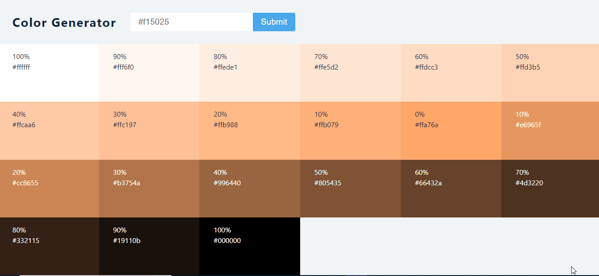

### React Color Generator

[view page](https://femi-ologunwa.github.io/9-reactjs-color-generator-project/)

### Implementation

-  Functionality to process form input
-  Implement try and catch structure in form submit handler to handle wrong form input.
-  A basic error-handling mechanism - using template string & ternary operator to conditionally add a class to an element to indicate error to user.
-  Implement how to get tints and shades of a CSS color with an external library [values.js](https://github.com/noeldelgado/values.js)
-  A basic use of react fragment.
   -Illustrate how to use inline styles with template string.
   -Implemented a function that converts rgb color values to hex color values.
-  Showing alert text when a div is clicked.
-  Hiding alert text after some seconds - Illustrating cleanup process in useEffect.
